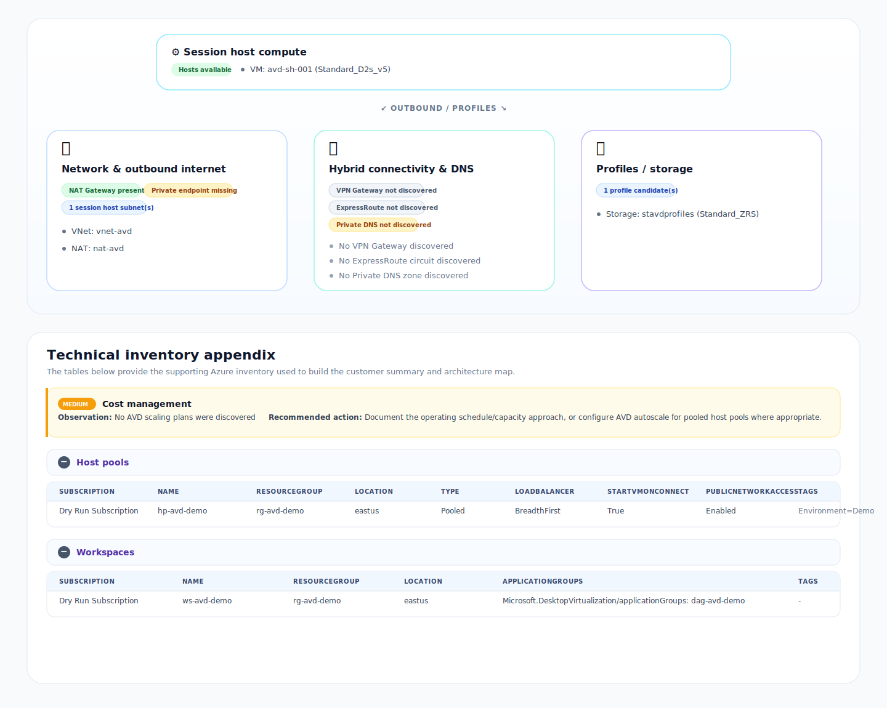

# AVD-Blueprint

**AVD-Blueprint v0.2.0** is a Cloud Shell–friendly, read-only PowerShell documentation assessor for Azure Virtual Desktop deployments. It inventories the core components of an AVD environment and generates a self-contained HTML documentation report for customer review.

It is designed for consultants and operators who need a structured AVD deployment document without collecting secrets or making changes to Azure.

## What it documents

- Azure Virtual Desktop host pools, workspaces, application groups, session hosts, and scaling plans
- IAM role assignments at the selected subscription or resource group scope
- VNets, subnets, NSGs, route tables, NAT Gateways, VPN Gateways, Local Network Gateways, ExpressRoute circuits, DNS settings, session host NICs, private DNS zones, and private endpoints
- Likely FSLogix/profile storage accounts based on names and tags
- Log Analytics workspaces and diagnostic settings
- Customer-friendly architecture/dependency map with compact state badges
- Section-level documentation findings before the detailed collapsible inventory tables



## Security model

AVD-Blueprint is read-only. It does not collect:

- Passwords
- Access tokens
- Storage account keys
- VM guest data
- User profile contents
- FSLogix container contents

Generated reports can still contain sensitive architecture and IAM metadata. Do **not** commit client reports to GitHub.

## Least-privilege permissions

Baseline:

- `Reader` on the subscription or target resource group

Optional enrichment:

- `Microsoft.Authorization/roleAssignments/read` for IAM visibility
- Monitoring Reader-style visibility for diagnostic settings
- Reader access to hub/spoke networking resource groups if AVD network, NAT Gateway, VPN Gateway, ExpressRoute, DNS, or private endpoint resources live outside the AVD resource group

## Azure Cloud Shell quick start

Open [Azure Cloud Shell](https://shell.azure.com) in **PowerShell** mode.

```powershell
# Clone the repo
git clone https://github.com/marsillig/AVD-Blueprint.git
cd AVD-Blueprint

# Optional: confirm Azure context
Get-AzContext

# Run with the existing Cloud Shell Azure context and save a timestamped report to Cloud Drive
./AVD-Blueprint.ps1 -UseExistingConnection -OutputPath ~/clouddrive/AVD-Blueprint-Report.html
```

Download the generated timestamped report, for example `AVD-Blueprint-Report-20260520-143000.html`, from Cloud Shell **Manage files** or from the Cloud Drive file share and open it locally.

## Parameters

| Parameter | Description | Example |
|---|---|---|
| `-SubscriptionId` | Subscription to document. Defaults to current Az context. | `00000000-0000-0000-0000-000000000000` |
| `-TenantId` | Tenant to authenticate against. Defaults to current context. | `11111111-1111-1111-1111-111111111111` |
| `-ResourceGroupName` | Optional resource group scope. Use subscription scope when network dependencies are in separate resource groups. | `rg-avd-prod` |
| `-HostPoolName` | Optional host pool scope. Requires `-ResourceGroupName`. | `hp-prod-pooled-01` |
| `-UseExistingConnection` | Use the current Az context; recommended in Cloud Shell. | switch |
| `-OutputPath` | HTML report path or directory. A timestamp is automatically appended to the filename. | `~/clouddrive/AVD-Blueprint-Report.html` |
| `-OpenReport` | Open the generated report locally. Ignored in Cloud Shell. | switch |

## Examples

`-OutputPath ~/clouddrive/AVD-Blueprint-Report.html` produces a timestamped file such as `AVD-Blueprint-Report-20260520-143000.html`.

```powershell
# Full current subscription, recommended when dependencies span multiple resource groups
./AVD-Blueprint.ps1 -UseExistingConnection -OutputPath ~/clouddrive/AVD-Blueprint-Report.html

# Specific subscription
./AVD-Blueprint.ps1 -UseExistingConnection -SubscriptionId "00000000-0000-0000-0000-000000000000" -OutputPath ~/clouddrive/AVD-Blueprint-Report.html

# Specific AVD resource group
./AVD-Blueprint.ps1 -UseExistingConnection -ResourceGroupName "rg-avd-prod" -OutputPath ~/clouddrive/AVD-Blueprint-Report.html

# Specific host pool
./AVD-Blueprint.ps1 -UseExistingConnection -ResourceGroupName "rg-avd-prod" -HostPoolName "hp-prod-pooled-01" -OutputPath ~/clouddrive/AVD-Blueprint-Report.html
```

## Scope guidance

For the most complete customer report, run at **subscription scope** when allowed. AVD environments often spread dependencies across multiple resource groups:

- AVD control plane resources in an AVD resource group
- Session host VNets/subnets/NAT Gateways in network resource groups
- VPN Gateway, ExpressRoute, private DNS zones, and private endpoints in hub/spoke resource groups
- FSLogix/profile storage in storage or platform resource groups
- Log Analytics workspaces in monitoring resource groups

If you run against a single resource group, the report will only document resources visible in that selected scope.

## Authentication troubleshooting

If IAM collection fails with an expired token warning, refresh the Cloud Shell context and rerun:

```powershell
Connect-AzAccount
./AVD-Blueprint.ps1 -UseExistingConnection -OutputPath ~/clouddrive/AVD-Blueprint-Report.html
```

If needed:

```powershell
Clear-AzContext -Force
Connect-AzAccount
Set-AzContext -Subscription "<subscription-id>"
```

## Repository hygiene

The `.gitignore` excludes generated reports, JSON exports, logs, local credentials, and Azure profile material. Keep all client-specific outputs outside source control.

## Relationship to AVD-Assess

AVD-Blueprint complements AVD-Assess. AVD-Assess focuses on health/best-practice scoring. AVD-Blueprint focuses on deployment documentation and inventory.

## License

MIT
