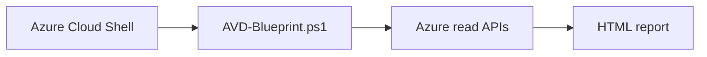

# Architecture

AVD-Blueprint reads Azure Resource Manager metadata and generates a self-contained HTML report.

```mermaid
flowchart LR
  CloudShell["Azure Cloud Shell"] --> Script["AVD-Blueprint.ps1"]
  Script --> Azure["Azure read APIs"]
  Azure --> Report["HTML report"]
```
