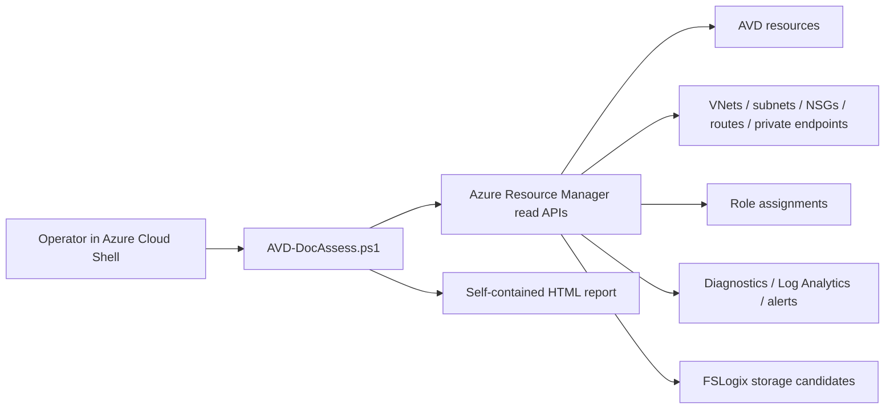

# AVD-DocAssess architecture

AVD-DocAssess is a read-only Azure inventory/documentation generator for Azure Virtual Desktop environments.

The tool does not collect secrets and does not write client reports into source control.
